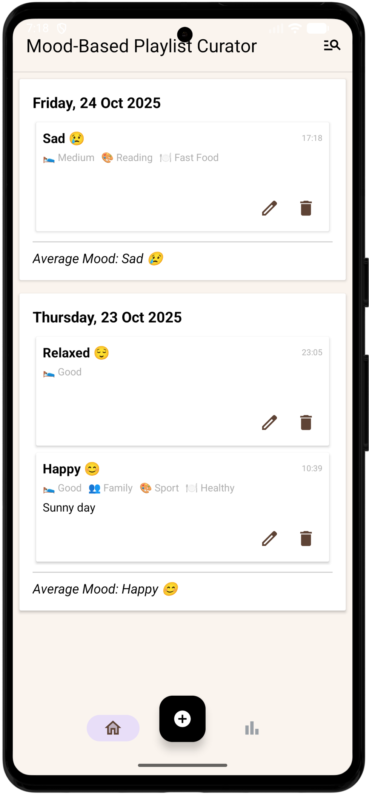
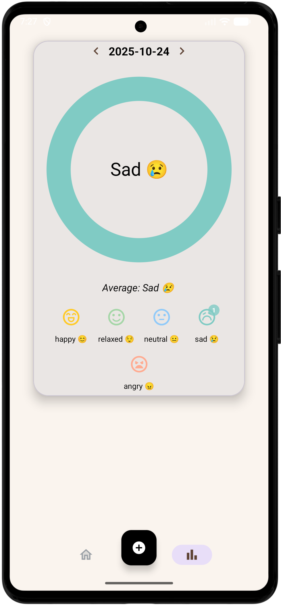

# 🎵 Mood-Based Playlist Curator

An Android app that lets users **track their daily moods**, add contextual details, and view **visual insights** about their emotional patterns over time.

---

## 🌈 Overview

**Mood-Based Playlist Curator** is a Kotlin + Android Studio project that demonstrates clean architecture, Material Design components, JSON persistence, and data visualization.

Users can:
- Log their **daily moods** (Happy, Relaxed, Neutral, Sad, Angry)
- Add optional details like **sleep quality**, **social activity**, **hobby**, and **food type**
- Write short **notes** about the day
- Review their mood history grouped by day
- See **insights** via a color-coded “mood ring” and daily averages

---

## 🖼️ Screenshot

  
  

---

## 🧠 Features

| Category | Description |
|-----------|--------------|
| **Mood Tracking** | Add, edit, or delete mood entries with rich context and emoji feedback. |
| **Daily Summaries** | Automatically groups moods by date with computed daily averages. |
| **Insights Screen** | Displays a custom circular chart (`DailyMoodRingView`) showing mood distribution per day. |
| **Filter & Search** | Filter moods by text, date range (All / Today / Last 7 days), or minimum daily average. |
| **Persistent Storage** | Moods are stored in a local JSON file (`moods.json`) using `MoodJSONStore`. |
| **Accessibility & i18n** | All visible text moved to `strings.xml` and icons include content descriptions. |
| **Material Design UI** | Uses Material 3 components, chips, sliders, and cards for a clean look. |

---

## ✨ Author

**María del Mar Madrid Delgado**  
📍 Mobile App Development 1 — South East Technological University (SETU)  
📅 October 2025  

